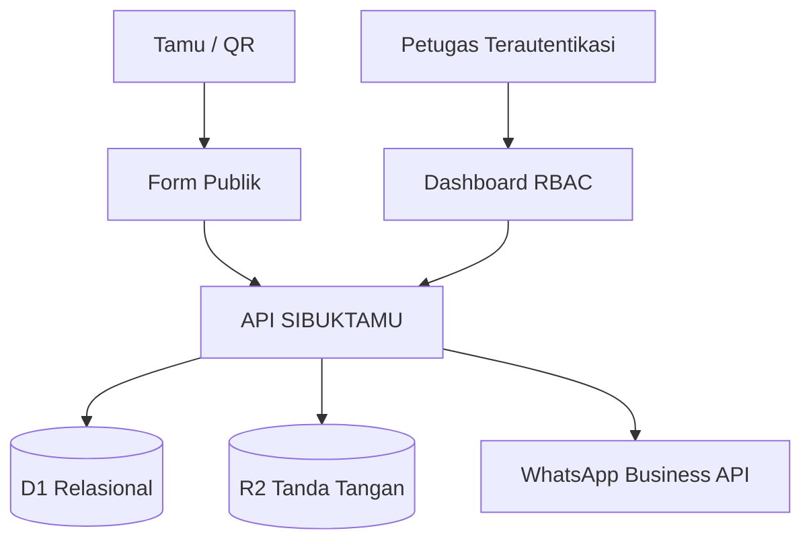

# SIBUKTAMU

Sistem Informasi Buku Tamu Digital Dinas Tenaga Kerja dan Transmigrasi Provinsi Sulawesi Tengah. Aplikasi ini mengutamakan prinsip **sedikit input dari tamu, banyak otomatisasi dari sistem**.

## Fitur utama

- Form tamu tanpa akun dalam tiga tahap, mobile-first, dan ramah lansia.
- Master 25 layanan yang dapat diubah Super Admin tanpa mengubah source code.
- Auto-routing layanan ke bidang yang bertanggung jawab.
- Nomor antrean harian dan kode `BT-YYYYMMDD-NNN` yang dibuat atomik oleh database.
- Tanda tangan HTML Canvas yang disimpan sebagai objek privat.
- Jam masuk/keluar WITA, durasi otomatis, dan check-out mandiri.
- Login akun internal dan dashboard berbasis peran: Super Admin, Front Office, Admin Bidang, dan Viewer.
- Alur status, transfer bidang, notifikasi internal dengan status dibaca/arsip/hapus, WhatsApp log/retry/manual fallback, dan audit trail.
- QR check-in/check-out, poster A4, laporan Excel `.xlsx`, PDF A4 landscape, pencarian, dan filter.
- Dashboard khusus layanan tenaga kerja (P4TK dan HIWAS) dengan statistik harian, antrean, durasi, tren, layanan teratas, dan profil pengunjung.
- Survei pelayanan opsional setelah check-out.
- Honeypot, rate limit, peringatan duplikasi, validasi server, data minimization, dan masking nomor HP untuk Viewer.

## Arsitektur



Frontend dan server route menggunakan Vinext/React, Tailwind CSS, dan komponen UI terakses. Data relasional berada pada D1 melalui Drizzle ORM. Tanda tangan privat berada pada R2. Halaman admin menggunakan akun internal SIBUKTAMU dengan hash PBKDF2, sesi HTTP-only, pembatasan percobaan login, pergantian sandi awal, dan otorisasi peran di server.

## Model data

Tabel utama:

- `roles`, `users`, `admin_credentials`, `admin_sessions`, `admin_login_attempts`
- `departments`, `services`, `employees`
- `visits`, `visit_status_logs`, `visit_transfers`
- `whatsapp_notification_logs`, `service_surveys`
- `settings`, `audit_logs`, `submission_attempts`

Seluruh migrasi ada di folder `drizzle/` dan harus diterapkan secara berurutan. Master bidang, layanan, peran, dan pengaturan awal ditanam secara idempoten pada penggunaan pertama.

## Alur akses admin pertama

Administrator masuk melalui `/admin/login` memakai username dan sandi sementara yang disimpan sebagai secret runtime. Pada login pertama, kredensial internal Super Admin dibuat dan sandi wajib diganti sebelum dashboard dapat digunakan. Super Admin kemudian dapat membuat username serta sandi sementara untuk petugas lain melalui menu Pengguna.

## Environment

Gunakan secret/runtime environment pada platform hosting. Jangan menaruh token pada source code.

```env
WHATSAPP_API_URL=https://graph.facebook.com/vXX.X
WHATSAPP_ACCESS_TOKEN=
WHATSAPP_PHONE_NUMBER_ID=
DEFAULT_ADMIN_WHATSAPP=
INITIAL_ADMIN_USERNAME=admin
INITIAL_ADMIN_PASSWORD=
INITIAL_ADMIN_EMAIL=
INITIAL_ADMIN_NAME=
```

`DEFAULT_ADMIN_WHATSAPP` menjadi nomor penerima awal untuk bidang layanan tenaga kerja yang belum memiliki nomor khusus. Jika konfigurasi WhatsApp Business API belum lengkap, kunjungan dan notifikasi internal tetap tersimpan. Dashboard menyediakan pengiriman manual melalui WhatsApp, sedangkan pengiriman otomatis baru aktif setelah `WHATSAPP_ACCESS_TOKEN` dan `WHATSAPP_PHONE_NUMBER_ID` tersedia.

## Halaman

Publik: `/`, `/kunjungan`, `/checkout`, `/privacy`, `/kiosk`.

Admin: `/admin/login`, `/admin/password`, `/admin/dashboard`, `/admin/kunjungan`, `/admin/bidang`, `/admin/layanan`, `/admin/pegawai`, `/admin/users`, `/admin/qrcode`, `/admin/laporan`, `/admin/notifikasi`, `/admin/audit-log`, `/admin/settings`.

## Pengembangan lokal

Persyaratan: Node.js 24 atau lebih baru.

```bash
npm ci
cp .dev.vars.example .dev.vars
npm run db:migrate:local
npm run dev
```

Pada Windows PowerShell gunakan `Copy-Item .dev.vars.example .dev.vars`. Isi `INITIAL_ADMIN_USERNAME`, `INITIAL_ADMIN_PASSWORD`, `INITIAL_ADMIN_EMAIL`, dan `INITIAL_ADMIN_NAME` di `.dev.vars` untuk mencoba login lokal. Gunakan sandi kuat yang baru, lalu ganti ketika pertama masuk. File ini diabaikan Git. Database dan tanda tangan lokal dibuat melalui binding `DB` dan `BUCKET` pada `wrangler.json`. ID database nol merupakan placeholder pengembangan lokal; ganti untuk deployment.

## Validasi

```bash
npm test
npm run test:security
npm run typecheck
npm run build
```

Pengujian keamanan menggunakan SQLite memori dan tidak mengirim WhatsApp atau mengubah data produksi. Rincian pengamanan dan acuan format laporan tersedia pada [dokumentasi keamanan dan laporan](docs/KEAMANAN-DAN-LAPORAN.md).

## Deployment pada akun Cloudflare instansi

1. Masuk dengan `npx wrangler login` pada komputer pengelola.
2. Buat database melalui `npx wrangler d1 create sibuktamu-db`, kemudian salin ID yang dikembalikan ke `database_id` dalam `wrangler.json`.
3. Buat bucket melalui `npx wrangler r2 bucket create sibuktamu-signatures`.
4. Jalankan `npm run db:migrate:remote` untuk menerapkan seluruh migrasi pada database yang telah dikonfigurasi.
5. Jalankan `npm run deploy`. Perintah ini membangun dan menerbitkan aplikasi lengkap, bukan situs statis.
6. Tambahkan secret melalui `npx wrangler secret put INITIAL_ADMIN_USERNAME --config wrangler.json`; ulangi untuk `INITIAL_ADMIN_PASSWORD`, `INITIAL_ADMIN_EMAIL`, dan `INITIAL_ADMIN_NAME`. Isikan pada prompt terminal, jangan pada kode.
7. Untuk WhatsApp otomatis, tambahkan `WHATSAPP_ACCESS_TOKEN`, `WHATSAPP_PHONE_NUMBER_ID`, `WHATSAPP_API_URL`, dan `DEFAULT_ADMIN_WHATSAPP` sesuai konfigurasi provider. Tanpa itu, gunakan notifikasi dalam aplikasi.
8. Masuk sebagai admin, ganti sandi awal, buat akun petugas, dan isi pejabat pengesahan laporan pada Pengaturan.
9. Hubungkan domain yang disediakan Disnaker melalui konfigurasi Workers, lalu uji alur tamu sampai selesai dan ekspor.

Repositori ini berisi kode, aset, dan migrasi. Database tamu, tanda tangan yang sudah tersimpan, akun petugas aktif, serta secret produksi tidak termasuk dalam repositori. Pemindahan data operasional memerlukan prosedur migrasi terpisah oleh pengelola. GitHub Pages saja tidak dapat menjalankan API, D1, dan R2 aplikasi ini.

## Strategi keamanan dan backup

- Seluruh mutasi admin diperiksa peran di server dan dicatat pada audit log.
- Sandi disimpan sebagai hash PBKDF2 dengan salt unik; token sesi disimpan dalam bentuk hash dan cookie HTTP-only.
- Query memakai prepared statement/ORM; input publik divalidasi dan dibatasi.
- Tanda tangan tidak memiliki URL publik langsung.
- Token WhatsApp hanya dibaca server dari environment.
- Backup berkala D1 dan R2 perlu dijadwalkan sesuai kebijakan instansi.
- Retensi dan penghapusan data harus mengikuti kebijakan kearsipan resmi, bukan otomatis tanpa persetujuan administrator.
