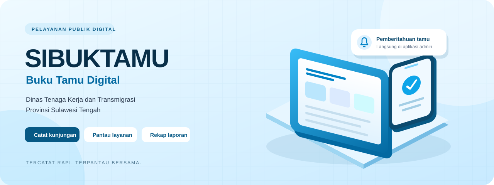
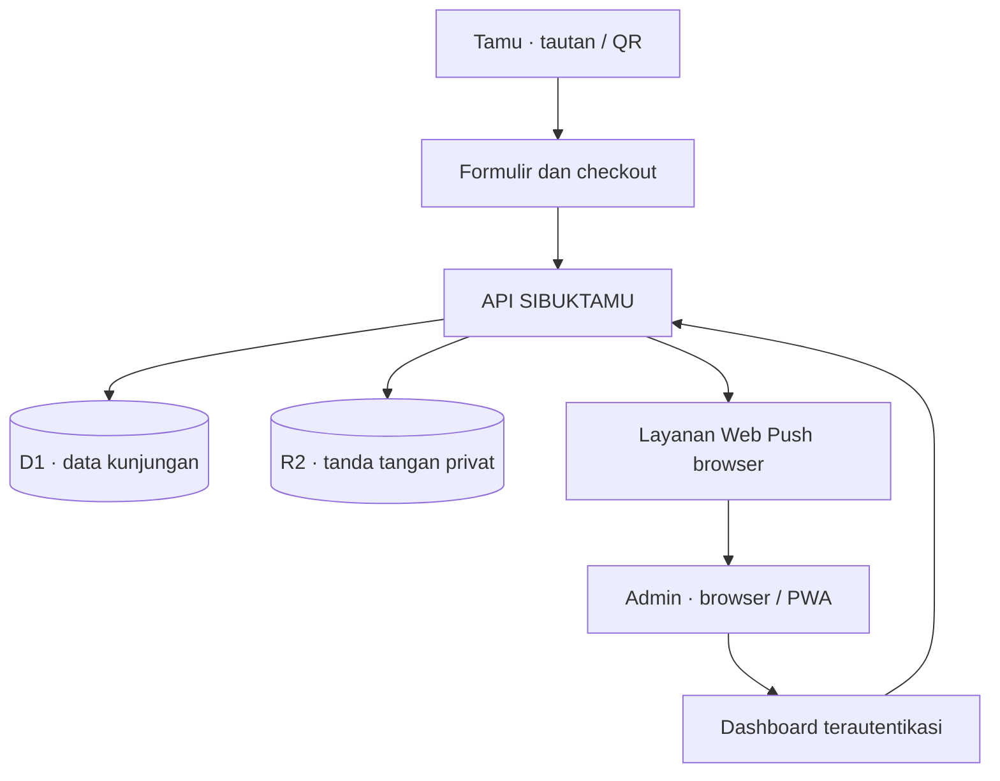

<p align="center">
  
</p>

<p align="center">
  <strong>Sedikit input dari tamu. Pencatatan yang lebih tertata untuk petugas.</strong><br />
  Sistem Informasi Buku Tamu Digital · Disnakertrans Provinsi Sulawesi Tengah
</p>

<p align="center">
  <a href="https://buku-tamu-digital-disnaker.mahyatibjm12345.chatgpt.site">Buka aplikasi</a> ·
  <a href="#fitur-saat-ini">Fitur</a> ·
  <a href="#aplikasi-admin-dan-notifikasi">Instal aplikasi admin</a> ·
  <a href="#menjalankan-di-laptop">Panduan lokal</a> ·
  <a href="#dokumentasi">Dokumentasi</a>
</p>

---

## Tentang SIBUKTAMU

SIBUKTAMU membantu petugas mencatat kedatangan, memantau pelayanan, dan menyusun laporan kunjungan dalam satu aplikasi. Tamu mengisi buku tamu melalui tautan atau QR, memilih bidang dan tujuan, lalu menandatangani formulir langsung di layar.

Tampilan menggunakan warna **biru langit**. Banner di atas merupakan ilustrasi konseptual bergaya 3D, bukan tangkapan layar dashboard.

> **Pembaruan dokumentasi — 24 September 2026**<br />
> Notifikasi operasional kini menggunakan pemberitahuan dalam aplikasi dan **Web Push**. Penawaran instalasi aplikasi tersedia setelah login admin. WAHA tidak lagi diperlukan pada alur notifikasi aktif.

## Fitur saat ini

| Untuk tamu | Untuk petugas |
| :--- | :--- |
| Isi buku tamu tanpa membuat akun | Dashboard statistik dan daftar kunjungan |
| Tiga tahap: identitas, layanan, konfirmasi | Kelola bidang, layanan, pegawai, dan pengguna |
| Filter bidang untuk menampilkan tujuan terkait | Pantau status serta perpindahan bidang |
| Pilihan **Lainnya** beserta uraian keperluan | Notifikasi kedatangan dan layanan selesai |
| Tanda tangan digital langsung di layar | Aplikasi admin yang dapat dipasang dari browser |
| Selesaikan layanan tanpa mengetik nomor antrean | Ekspor Excel dan PDF dengan tanda tangan |
| Ulasan kepuasan opsional setelah selesai | Pencarian, filter laporan, QR, dan audit log |

### Pengisian buku tamu

1. **Identitas:** tamu mengisi data diri. Pada implementasi saat ini, formulir masih meminta nomor WhatsApp sebagai data kontak; pengiriman notifikasi admin tidak bergantung pada nomor tersebut.
2. **Layanan:** pilih bidang agar tujuan terkait muncul. Sekretariat Dinas dan Penerima Tamu tetap tersedia terpisah dari filter bidang. Jika memilih **Lainnya**, tamu mengisi keperluannya; uraian tersebut ditampilkan pada konfirmasi.
3. **Konfirmasi:** periksa data, bubuhkan tanda tangan, setujui penggunaan data, lalu kirim. Sistem mencatat waktu masuk serta membuat nomor antrean dan kode kunjungan.
4. **Selesai:** buka menu penyelesaian layanan, cari nama yang masih aktif, kemudian konfirmasikan **Selesaikan layanan**. Nomor antrean tetap tersedia sebagai referensi, tetapi tidak wajib diketik untuk checkout.
5. **Ulasan:** nama keluar dari daftar aktif setelah selesai. Tamu dapat memberikan penilaian kepuasan melalui pilihan ekspresi.

### Dashboard dan laporan

- Ringkasan kedatangan, tamu menunggu, sedang dilayani, kunjungan selesai, total bulanan, dan durasi pelayanan.
- Grafik kunjungan, layanan teratas, profil pengunjung, serta daftar tamu terbaru.
- Laporan **Excel `.xlsx`** dan **PDF A4 landscape**, dengan identitas instansi dan pengaturan pejabat pengesahan.
- Tanda tangan tamu disertakan dalam ekspor; tanda tangan yang tidak tersedia atau tidak terbaca diberi keterangan.
- Kop, isi, dan pengesahan laporan tetap perlu diperiksa petugas sesuai kebutuhan administrasi instansi.

## Aplikasi admin dan notifikasi

| Kemampuan | Perilaku saat ini |
| :--- | :--- |
| Pemberitahuan dalam aplikasi | Kedatangan dan penyelesaian layanan disimpan per akun; status dibaca dipisahkan antar-admin. |
| Bunyi dashboard | Diaktifkan melalui **Aktifkan suara**. Dashboard memeriksa pembaruan setiap 15 detik saat halaman terlihat. |
| Notifikasi HP | Web Push dikirim ke perangkat admin yang telah berlangganan dan mengizinkan notifikasi. |
| Instalasi | Penawaran instalasi hanya ditampilkan setelah login admin, termasuk akun lama Admin Bidang. |
| Login tersimpan | Sesi hingga **400 hari**, diperpanjang saat digunakan; tidak menggunakan batas tidak aktif 12 jam. |
| Privasi layar kunci | Pesan push bersifat umum; rincian dan identitas tamu dibuka melalui aplikasi. |

### Mulai memakai aplikasi di HP

1. Buka [SIBUKTAMU](https://buku-tamu-digital-disnaker.mahyatibjm12345.chatgpt.site), lalu login sebagai admin.
2. Pilih **Instal aplikasi admin**. Jika browser tidak menampilkan dialog, ikuti petunjuk pada halaman.
3. Buka aplikasi yang terpasang. Pada iPhone yang mendukung, gunakan **Safari → Bagikan → Tambahkan ke Layar Utama** terlebih dahulu.
4. Pilih **Aktifkan notifikasi HP** dan berikan izin. Untuk bunyi saat dashboard terbuka, pilih **Aktifkan suara**.
5. Uji dengan satu kunjungan percobaan dan periksa notifikasi pada perangkat masing-masing admin.

<details>
<summary><strong>Batasan instalasi, notifikasi, dan login</strong></summary>

- Dukungan instalasi dan Web Push ditentukan oleh browser serta sistem operasi. Notifikasi saat aplikasi ditutup memerlukan koneksi, izin, dan pengaturan daya yang mendukung; penerimaan tidak dijamin pada semua perangkat.
- Riwayat pada menu Notifikasi tetap menjadi rujukan apabila pemberitahuan HP terlewat.
- Keluar manual, perubahan sandi, pencabutan akses, kedaluwarsa sesi, penghapusan data browser, atau kebijakan penyimpanan browser dapat mengharuskan login ulang.
- Pengguna masih bisa membuat pintasan manual melalui browser. Pintasan tersebut tidak memberikan akses admin tanpa autentikasi.
- Aplikasi tetap memerlukan internet. Service worker tidak menyimpan halaman admin atau data tamu untuk akses offline.
- Tidak diperlukan server WAHA tambahan. Hosting aplikasi, database, dan penyimpanan tetap mengikuti kuota serta biaya platform yang digunakan.

</details>

### Peran pengguna

| Peran | Penggunaan |
| :--- | :--- |
| Admin / Super Admin | Pengelolaan operasional, pengguna, pengaturan, laporan, dan notifikasi. |
| Admin Bidang lama | Dinormalisasi menjadi Admin dengan tampilan dan akses penuh yang sama. |
| Front Office | Akses operasional sesuai otorisasi server; bukan akses pengelolaan penuh. |
| Viewer | Akses baca sesuai otorisasi; perubahan data dibatasi. |

Notifikasi perangkat ditujukan kepada Admin aktif yang mengaktifkannya. Nomor WhatsApp admin tidak diperlukan.

## Arsitektur



| Bagian | Teknologi |
| :--- | :--- |
| Antarmuka | React 19, Tailwind CSS 4, komponen UI |
| Aplikasi dan API | Vinext, Vite, route bergaya Next.js |
| Runtime | Cloudflare Workers |
| Database | Cloudflare D1 dan Drizzle ORM |
| Tanda tangan | Canvas pada formulir, penyimpanan privat R2 |
| Laporan | ExcelJS dan pdf-lib |
| Pemberitahuan | Service worker dan Web Push terenkripsi |
| Autentikasi | Akun internal, hash sandi PBKDF2, cookie sesi HttpOnly |

## Menjalankan di laptop

**Prasyarat:** Node.js 24 atau lebih baru, npm, dan Git. Perintah berikut memakai konfigurasi pengembangan lokal yang ada di repositori.

```bash
git clone https://github.com/Rifkyharunac/SIBUKTAMU.git
cd SIBUKTAMU
npm ci
```

Salin contoh konfigurasi:

```powershell
# Windows PowerShell
Copy-Item .dev.vars.example .dev.vars
```

```bash
# Linux / macOS
cp .dev.vars.example .dev.vars
```

Isi variabel berikut pada `.dev.vars` dengan data pengelola dan sandi kuat yang baru:

```dotenv
INITIAL_ADMIN_USERNAME=admin
INITIAL_ADMIN_PASSWORD=
INITIAL_ADMIN_EMAIL=
INITIAL_ADMIN_NAME=
```

Nilai sandi di atas sengaja dikosongkan. Variabel ini digunakan untuk penyiapan admin awal, bukan untuk mengubah sandi akun yang sudah tersimpan. Konfigurasi WA/WAHA yang masih ada pada contoh lama tidak diperlukan untuk notifikasi aplikasi saat ini.

```bash
npm run db:migrate:local
npm run dev
```

Buka alamat yang ditampilkan terminal. Login melalui `/admin/login`, lalu ganti sandi sementara saat diminta. Admin dapat membuat akun petugas lain melalui menu **Pengguna**.

Binding lokal menggunakan `DB` dan `BUCKET` pada `wrangler.json`. ID database nol merupakan placeholder lokal dan harus diganti untuk deployment mandiri. Instalasi serta notifikasi perangkat perlu diuji melalui situs HTTPS pada HP yang akan dipakai.

## Validasi pengembangan

```bash
npm test
npm run test:security
npm run typecheck
npm run build
```

Pengujian integrasi menggunakan database SQLite sementara dan pengiriman push tiruan. Cakupannya meliputi autentikasi, otorisasi, formulir, checkout, ekspor tanda tangan, notifikasi per admin, serta pencabutan akses perangkat. Pengujian tersebut tidak mengirim pemberitahuan kepada staf dan tidak menggantikan uji penerimaan pada HP sebenarnya.

## Deployment dan pembaruan

Situs aktif tersedia melalui tautan **Buka aplikasi** di atas. Perubahan pada GitHub tidak otomatis membuktikan bahwa situs aktif sudah diperbarui; versi aplikasi perlu diterbitkan melalui lingkungan hosting yang digunakan.

<details>
<summary><strong>Deployment mandiri pada akun Cloudflare instansi</strong></summary>

1. Jalankan `npx wrangler login` pada komputer pengelola.
2. Buat database dengan `npx wrangler d1 create sibuktamu-db`. Salin `database_id` yang dikembalikan ke `wrangler.json`.
3. Buat penyimpanan dengan `npx wrangler r2 bucket create sibuktamu-signatures`.
4. Terapkan migrasi secara berurutan menggunakan `npm run db:migrate:remote`.
5. Jalankan `npm run deploy` untuk membangun dan menerbitkan aplikasi lengkap.
6. Tambahkan secret awal melalui `npx wrangler secret put INITIAL_ADMIN_USERNAME --config wrangler.json`; ulangi untuk `INITIAL_ADMIN_PASSWORD`, `INITIAL_ADMIN_EMAIL`, dan `INITIAL_ADMIN_NAME`. Isi nilai pada prompt terminal.
7. Login, ganti sandi awal, buat akun petugas, lalu periksa bidang, tujuan, serta pejabat pengesahan laporan.
8. Aktifkan notifikasi pada perangkat admin. Kunci Web Push dibuat otomatis dan disimpan pada database privat.
9. Uji pengisian, notifikasi, checkout, ulasan, dan ekspor sebelum penggunaan operasional.

</details>

**Saat memperbarui instalasi yang sudah berjalan:** cadangkan data, ambil perubahan kode, pasang dependensi, jalankan migrasi yang belum diterapkan, lalu bangun dan terbitkan aplikasi. Migrasi `0009_admin_app_notifications.sql` menambahkan dukungan notifikasi per akun dan perangkat; jangan dilewati.

Repositori berisi kode, aset, dan migrasi. Data tamu produksi, tanda tangan tersimpan, akun aktif, serta secret tidak ikut tersalin ketika melakukan clone. Pemindahan hosting memerlukan migrasi data terpisah. GitHub Pages saja tidak menjalankan API, D1, dan R2 aplikasi ini.

## Struktur repositori

| Lokasi | Isi |
| :--- | :--- |
| `app/` | Halaman publik, admin, dan API |
| `components/` | Formulir, dashboard, serta panel aplikasi admin |
| `lib/` | Autentikasi, aturan kunjungan, keamanan, dan Web Push |
| `db/` | Skema dan data awal |
| `drizzle/` | Migrasi database berurutan |
| `public/` | Logo, aset, dan service worker admin |
| `worker/` | Entrypoint server dan pengiriman notifikasi di latar belakang |
| `tests/` | Pengujian aturan dan integrasi |
| `docs/` | Panduan teknis serta riwayat revisi |

Nama tabel `whatsapp_notification_logs` masih dipertahankan untuk kompatibilitas data lama; tabel tersebut kini juga menyimpan notifikasi aplikasi. Data Web Push berada pada `admin_push_config` dan `admin_push_subscriptions`. Keberadaan modul atau dokumentasi WAHA lama tidak berarti transport WhatsApp masih aktif.

## Pengamanan dan pengelolaan data

- Otorisasi diperiksa pada server; sandi disimpan sebagai hash dan token sesi disimpan dalam bentuk hash.
- Cookie sesi menggunakan Secure, HttpOnly, dan SameSite; input divalidasi dan permintaan tertentu dibatasi lajunya.
- Tanda tangan tidak memiliki URL publik langsung. Endpoint langganan push divalidasi dan dikaitkan dengan akun serta sesi.
- Secret, `.dev.vars`, data tamu, dan dokumen operasional tidak boleh dimasukkan ke commit.
- Pengelola perlu menyiapkan pencadangan D1/R2 serta kebijakan retensi dan penghapusan sesuai ketentuan instansi.

## Dokumentasi

- [Keamanan dan laporan](docs/KEAMANAN-DAN-LAPORAN.md)
- [Revisi struktur kantor](docs/REVISI-STRUKTUR-KANTOR-2026-09-17.md)
- [Riwayat revisi kontak dan tujuan](docs/REVISI-KONTAK-DAN-TUJUAN.md)
- [Pemberitahuan komponen pihak ketiga](THIRD_PARTY_NOTICES.md)

Panduan WAHA dalam repositori merupakan referensi integrasi lama. Untuk operasional saat ini, ikuti bagian **Aplikasi admin dan notifikasi** pada README ini.

---

<p align="center">
  <strong>SIBUKTAMU</strong><br />
  Buku Tamu Digital · Disnakertrans Provinsi Sulawesi Tengah<br />
  <sub>Dokumentasi untuk petugas, pengelola, dan pengembang.</sub>
</p>
